# DeepTail

[](https://www.typescriptlang.org/)
[](https://bun.sh/)
[](https://tauri.app/)
[](https://doc.rust-lang.org/edition-guide/rust-2024/)
[](https://vite.dev/)
[](https://playwright.dev/)
[](#layout)
[](LICENSE)

A Tauri 2 client — desktop, iOS, and Android — that connects to
[DeepSeek Harness](https://github.com/deepseek-ai/deepseek-harness) hosts and
gives you one control plane over the agent sessions running on all of them.


## Explain it like I'm five

You have robot helpers working on several computers at once. Each computer keeps
its own list of what its helpers are doing, and to check on them you would have
to walk over to every computer in turn.

DeepTail is one window that shows every list at the same time. You open it and
see every helper on every computer, which ones are busy right now, and when each
one last did something. You can start a new helper, tell one what to do next,
or tell one to stop — without going to that computer.

When you want to *read* everything a helper wrote, DeepTail opens that computer's
own reader, because that computer is the one holding the whole story.

Three rules it keeps:

- **One computer answers for itself.** If one is switched off, its row says so
  and offers a Retry. The others keep working — one broken computer never blanks
  the window.
- **The password never touches the page.** The part you see is just drawing.
  A separate Rust part holds the key for each computer and does the talking.
- **It can find the computers for you.** If they are on your Tailscale network,
  DeepTail lists them by name instead of asking you to type an address.
- **One scrollbar per direction.** Panes do not nest inside other panes, so the
  wheel always moves the thing you are pointing at.

## How it works

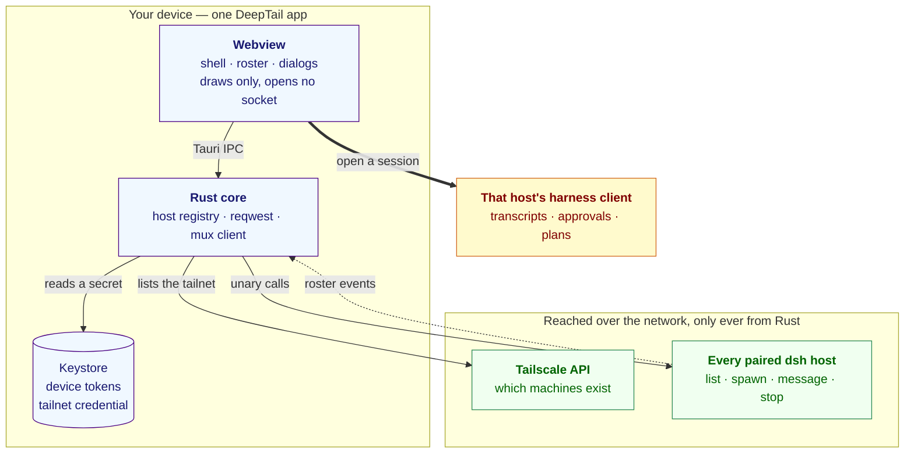

Two things the chart is drawn to show. Every arrow that crosses the device
boundary starts at Rust, never at the webview — the solid one is the unary call
DeepTail makes, the dashed one is the stream that keeps the roster current
without polling, and the device token stays on the Rust side of the IPC in both.
And the thick arrow is the product boundary: DeepTail owns the fleet, the
harness client owns one conversation, and choosing a session is where one hands
over to the other.

## What it does

**DeepTail is the control plane; the harness client is the reader.** Everything
DeepTail does is a unary call that works over its own carrier today. Reading a
conversation is a stream, and that belongs to the client already built for it.

| DeepTail | The harness client |
|---|---|
| Pair, switch and unpair hosts | Transcripts and tool cards |
| Find hosts on your tailnet | |
| One roster across every paired host, live | Approvals, projects, plans |
| Spawn a session from an agent preset | Everything session-local |
| Message or steer a session | |
| Stop a running turn | |

Choosing a session hands off: DeepTail boots that host's own client. It opens at
the client's default view — nothing in its boot surface takes a session id — and
the copy says so rather than implying a deep link it cannot deliver.

## Tailscale

Typing a URL is not how anyone finds their own machines. DeepTail lists your
tailnet through Tailscale's own API and shows which machines are already
paired, so a host is chosen from a list rather than transcribed.

Both credentials Tailscale issues work, because they are not interchangeable: an
[API key](https://tailscale.com/kb/1101/api) is one secret that expires on a
fixed date, authenticated as the username of an HTTP Basic pair; an
[OAuth client](https://tailscale.com/kb/1215/oauth-clients) is the id and secret
pair Tailscale documents for long-running integrations, exchanged at
`/api/v2/oauth/token` for short-lived bearers and needing the `devices:core`
scope. Either lists `/api/v2/tailnet/{tailnet}/devices?fields=all`, where the
tailnet defaults to `-` — the one that credential belongs to. The credential is
filed in the same platform keystore as every device token and never crosses the
IPC boundary; the page receives machines, never the key that listed them.

**Listing a tailnet is not pairing.** Tailscale can say which machines exist;
only `dsh web` can mint the launch token a harness accepts. Choosing a machine
therefore opens the pairing form for it — with the origin already fixed, so the
one thing left to supply is the token that machine printed.

Discovery is also what makes `http://` admissible. A tailnet peer is reached
over WireGuard, so the packets are encrypted and peer-authenticated before the
URL scheme has any say; `dsh web` on a tailnet terminates no TLS and does not
need to. `canonical_origin` admits plaintext to a tailnet peer and to loopback
and refuses it everywhere else, reading Tailscale's own ranges — `100.64.0.0/10`
minus the `100.115.92.0/23` slice ChromeOS uses for its containers,
`fd7a:115c:a1e0::/48`, and MagicDNS names under `.ts.net`.

## Why the wire lives in Rust

**The webview never opens a network connection.** Tauri serves the page from a
secure-context origin, so it cannot open a `ws://` socket at all and cannot
attach an `Authorization` header to a WebSocket handshake. Holding the wire in
Rust removes both limits, keeps the device token out of JavaScript, and lets the
app ship a CSP that names no host:

```
default-src 'self'; script-src 'self' blob:; connect-src ipc: http://ipc.localhost
```

## Design

The UI is plain DOM — it paints before any harness bundle loads — but not a
separate design language. `src/styles/tokens.css` holds the harness's own
resolved `--dsw-alias-*` and `--dsw-specific-*` values and its
`body[data-ds-dark-theme]` mechanism; geometry follows `ui-sidebar`,
`ui-primitives/Menu`, `ui-primitives/Modal` and `ui-workspace/rows`.

**No inline styles.** Every visual is a class, enforced by
`scripts/check-no-inline-styles.ts`. It reads a parse rather than lines — oxc
for scripts, the parser oxlint uses, and parse5 for markup — so the rules are
stated about nodes and there is no spelling to get around them: the dotted
property, an indexed write, a bulk assign, destructuring, the CSS Typed OM, a
`style` attribute in markup written anywhere in the source, and any call that
sets an attribute or a property under that name. Names are constant-folded, so
one held in a constant, split with `+`, built in a template, case-shifted,
joined or spelt from character codes is read as the name it produces; a name the
gate cannot read at all is refused rather than allowed. The two calls that set an
attribute without naming it — `setAttributeNode` and `setNamedItem` — are
refused outright.

The files it reads are the files git says the repository ships, so its reach
cannot drift from a hand-written list and its count does not move with whether a
build has run. `scripts/ban-gate.ts` reads the same parse for idioms the project
has moved past and for directives that switch a checker off; a directive is only
ever a comment, so the comments are what it searches, and Rust is searched too.
Both gates are driven by `tests/gates.spec.ts`, which runs every rule against a
source that breaks it and a source that merely resembles it.

A stylesheet is not an inline style and is not banned: `injections.ts` builds
one because the host's boot table says to. Neither is `color-scheme`, a CSS
property keyed off the same `body[data-ds-dark-theme]` attribute as the palette,
so native UA chrome cannot drift from the theme. Beyond those, the gate has no
allowances.

A sheet's values are read against the token sheet too. `scripts/sheet-gate.ts`
refuses a bare length outside `tokens.css` — spacing, radius, type and grid
rungs — a raw colour in any spelling (a function-written or named colour, or a
hex literal), a cascade override flag, a legacy `float`, a bare stacking number,
a second breakpoint in a second syntax, a rule that hides the focus ring
without painting one back, and a rule set declared twice. Every value the
shipped sheets carry goes through the tokens, and `tests/sheet-gate.spec.ts`
drives each rule both ways.

The markup gate reads every element, whatever writes it: besides the `style`
attribute, an inline event handler, an inline script body and an inline style
block are each a per-page one-off that no module ships and no gate reads once
it sits inside a tag, so none may ship. The ban gate carries the same shape of
rules for idioms the project has moved past: the React 19 removals
(`ReactDOM.render` and its siblings, `findDOMNode`, string refs,
`defaultProps`, legacy context), the Tauri v1 API paths and the `__TAURI__`
global, alongside the older bans on `var`, `require`, markup-rewriting
properties, `eval` and the rest. `tests/gates.spec.ts` and
`tests/style-gate.spec.ts` drive both gates against a source that breaks each
rule and a source that merely resembles it.

| | |
|---|---|
|  |  |
| Host switcher — selection is a trailing check, never a fill | The harness dark palette |
|  |  |
| Message or steer a session | 390×844, sidebar as a drawer |
| 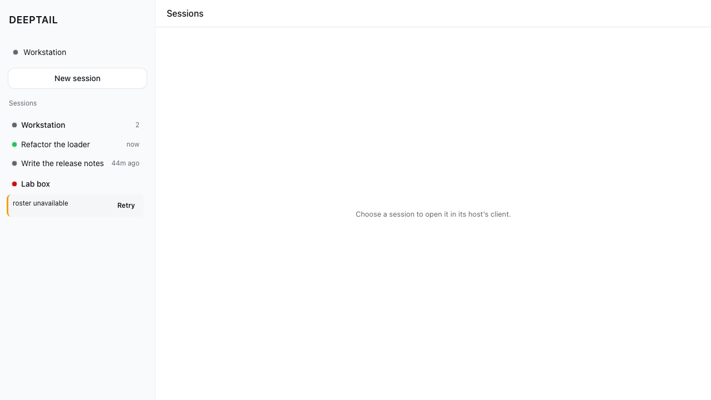 | 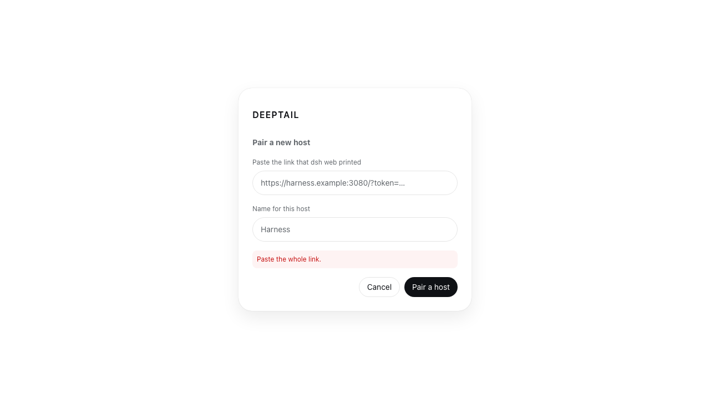 |
| One host down, the rest still listed, Retry on the row that failed | The refusal names what to fix, below the field it is about |
| 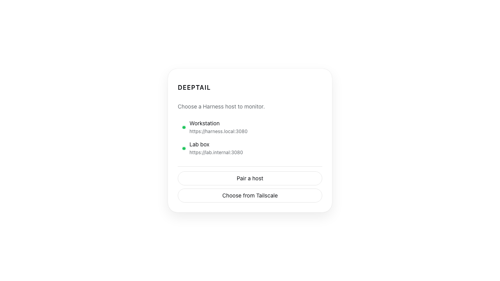 | 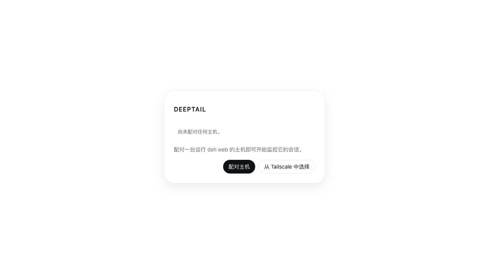 |
| Paired hosts, before a shell exists | The empty picker in Chinese — every string comes from the dictionary |
| 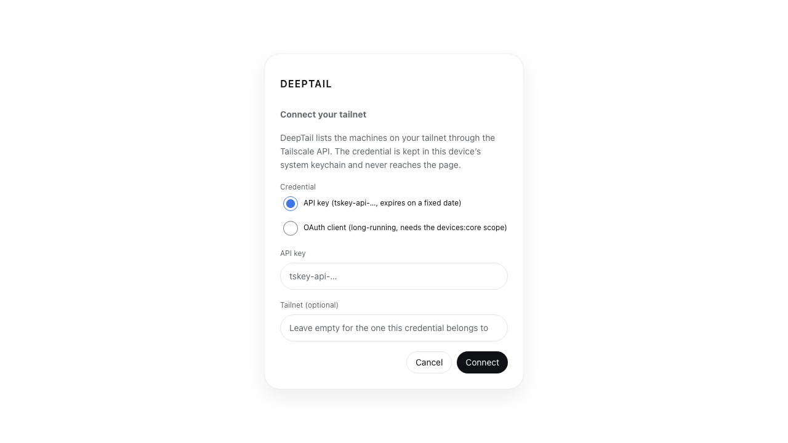 | 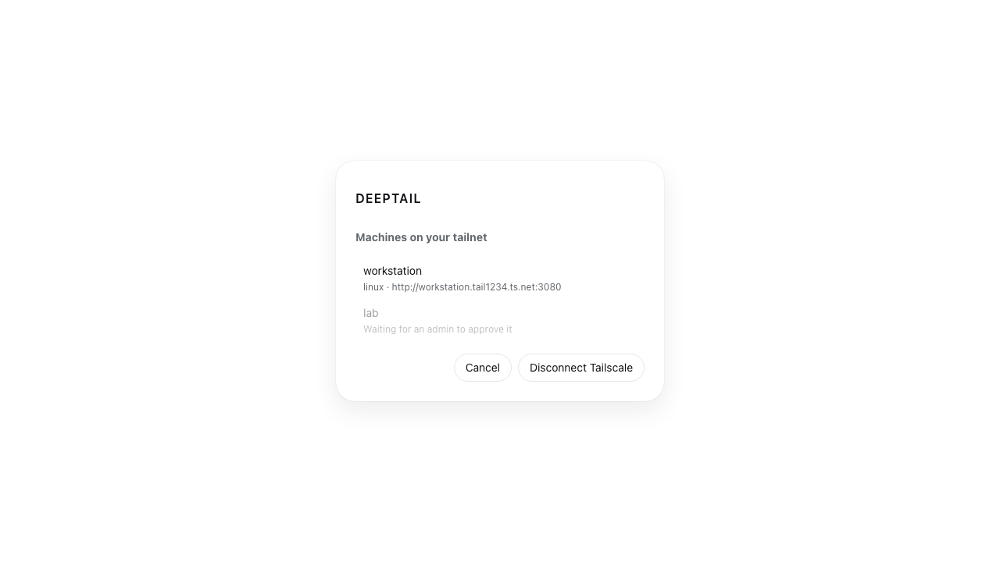 |
| Either credential Tailscale issues, and an optional tailnet | Your machines, with the one awaiting approval dimmed rather than hidden |
| 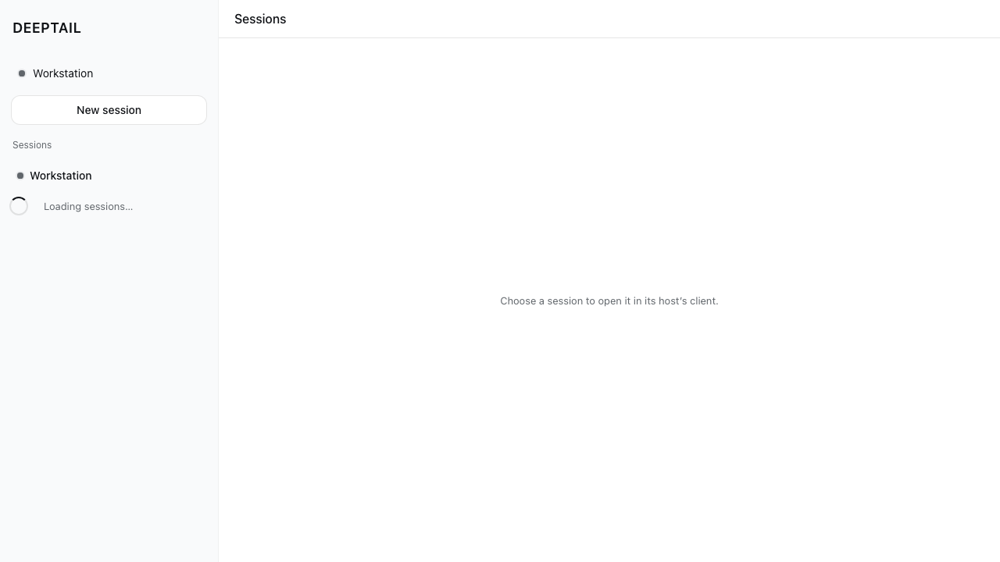 | 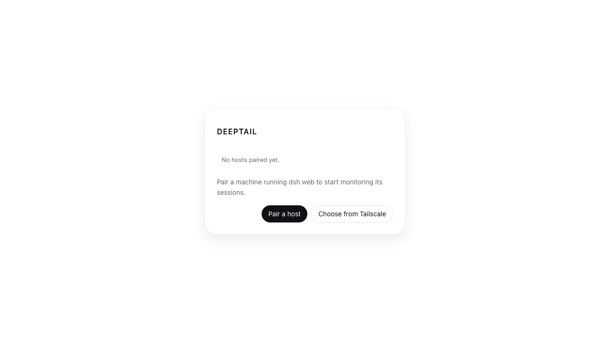 |
| Before the first roster read settles | Nothing paired: pair a host, or choose one from Tailscale |
| 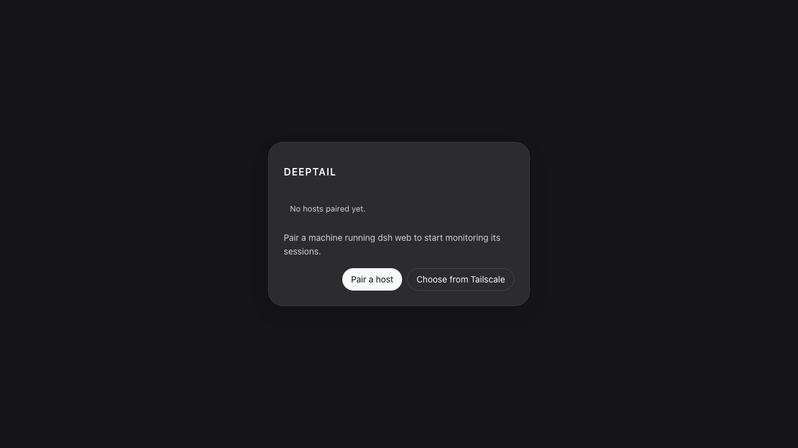 | 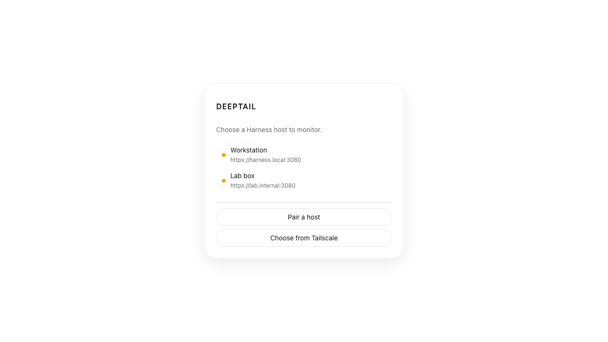 |
| Nothing paired, in the dark palette | Paired hosts whose device tokens the harness no longer accepts |

Every state is built and screenshotted: loading, empty-after-settled, error,
partial failure (one host down, the rest still listed), unauthorized, and
offline, and both tailnet screens. `apps/deeptail/tests/screenshots/` holds all
22, and each is written by the case that asserts the state, so none can drift
from the code.

## Layout

```
apps/deeptail/
  src/            shell, connection menu, roster, dialogs, carrier, stream client
  src-tauri/      the entire network and credential surface, Tailscale included
packages/host-fleet/   Cordis plugin: sessions_* orchestration tools
profile/               the dsh profile DeepTail installs on a host
```

## Credentials

One device token per host in the platform's own store. The all-in-one `keyring`
crate is desktop-only in its default feature, so this uses `keyring-core` with
one native store per target — which is what makes iOS and Android work:
`apple-native-keyring-store`, `android-native-keyring-store` (Keystore +
SharedPreferences), `windows-native-keyring-store`,
`dbus-secret-service-keyring-store`.

Pairing spends the launch token `dsh web` already prints. Plaintext pairing is
refused off loopback.

## Harness seams

Reading a conversation needs the harness client, and that client cannot boot
until three changes land upstream. The control plane does not depend on them.

| Seam | Why |
|---|---|
| A socket factory on `ClientTransportHooks` | `remoteStreamUrl()` derives the mux authority from `location.origin`, and a secure-context page cannot open `ws://` |
| `collectIndexInjections()` over an authenticated `/api` route | the boot table is reachable only as injected HTML |
| Promote `applyIndexInjections` out of `packages/experimental/` | a non-served shell needs it, and that package is not published |

## Development

```sh
bun install
bun run validate          # biome, oxlint, styles gate, typecheck, tests, knip, clippy, cargo test, browser
bun run tauri dev         # desktop
bun run tauri android dev # Android Studio, JAVA_HOME, ANDROID_HOME, NDK_HOME
bun run tauri ios dev     # macOS + Xcode + CocoaPods only
```

Browser tests drive the real built bundle in Chromium and substitute only the
Tauri IPC boundary, which no browser provides. They assert on rendered text and
roles and write every screenshot above. The scripted IPC covers the mux socket
as well as unary calls, so the live roster — a row arriving over `$events`, a
removal, a status flip, a dropped stream — is exercised rather than assumed.

Two suites read the rendered page rather than the source. `a11y.browser.spec.ts`
runs axe over `wcag2a`, `wcag2aa`, `wcag21a`, `wcag21aa`, `wcag22aa` and
`best-practice`, and treats `incomplete` as a violation, so a rule axe could not
settle is a failure rather than a pass. `structure.ts` covers what no rule engine
reports: a duplicate id, an interactive element inside another, a skipped heading
level, an ARIA reference pointing at nothing, an item outside its list, a
document that scrolls sideways, text clipped by its own box, a pane that scrolls
inside a pane that also scrolls, and a target under the floor for its pointer —
24 CSS px on any pointer per WCAG 2.2 SC 2.5.8, and 44 on a finger, which is
what Apple's Human Interface Guidelines and SC 2.5.5 ask. The geometry half
lives in `structure-layout.ts`; both are shipped into the page as their own
source text, so nothing they measure against can be left behind.

The suites split the same way. `structure.browser.spec.ts` walks the surfaces
and asserts each is clean; `structure-geometry.browser.spec.ts` measures what a
finger reaches and, because a check that never reports is indistinguishable from
one that cannot, makes the shell scroll inside itself and asserts the pane rule
names it. The 44px floor is only measured on a page opened with `hasTouch`:
`pointer: coarse` does not hold on a narrow desktop window, so measuring one
against it would test a pairing that does not exist.

Every dependency is held at the newest version this workspace can install.
`check:outdated` reads `bun outdated` — the package manager's own report, which
already knows about ranges, workspaces and the supply-chain hold in
`bunfig.toml` — rather than asking the registry itself. A version the hold is
withholding is reported and passes: that hold is policy working, and demanding
it would make going green require bypassing it.

Playwright resolves the Chromium it installed. An image that pre-ships one at a
fixed path instead names it in `apps/deeptail/tests/chromium.json`:

```json
{ "executablePath": "/opt/pw-browsers/chromium-1194/chrome-linux/chrome" }
```

## Toolchain

TypeScript 7.0.2 · Bun 1.4 · Node 24 LTS · Tauri 2.11 · Rust edition 2024 ·
Vite 8 · Playwright 1.62.1.

## License

MIT
