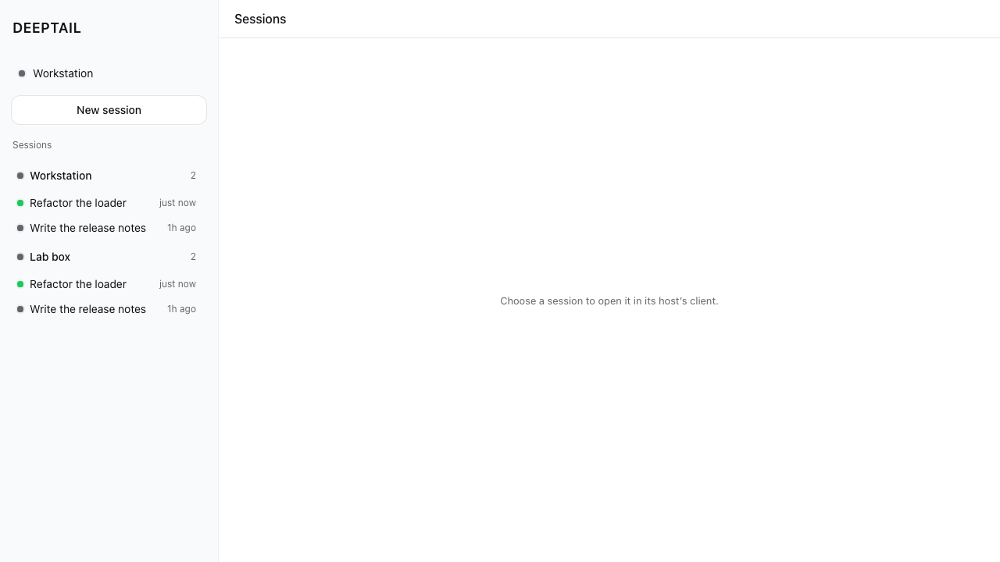
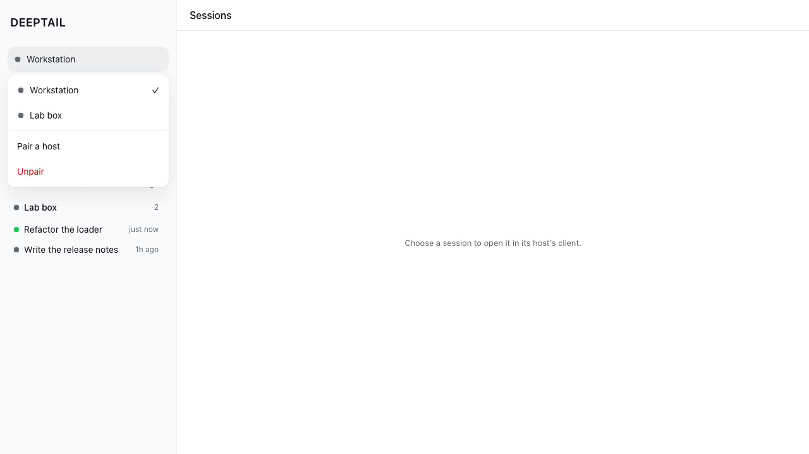
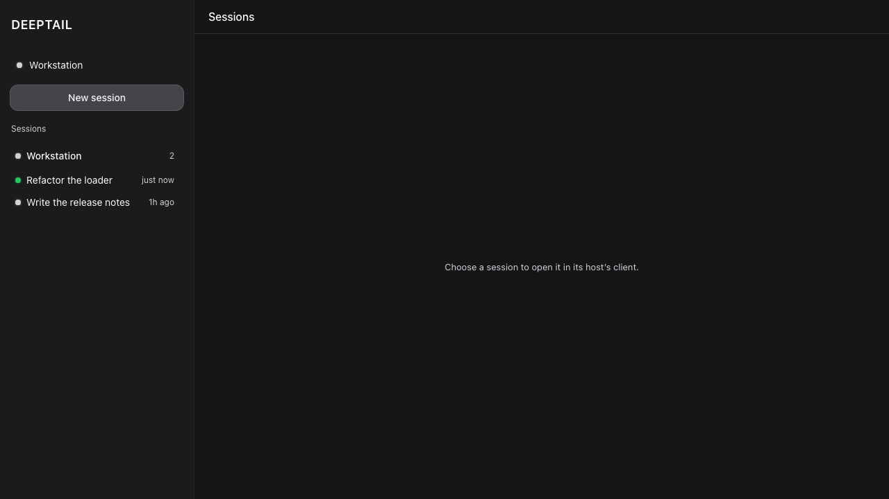
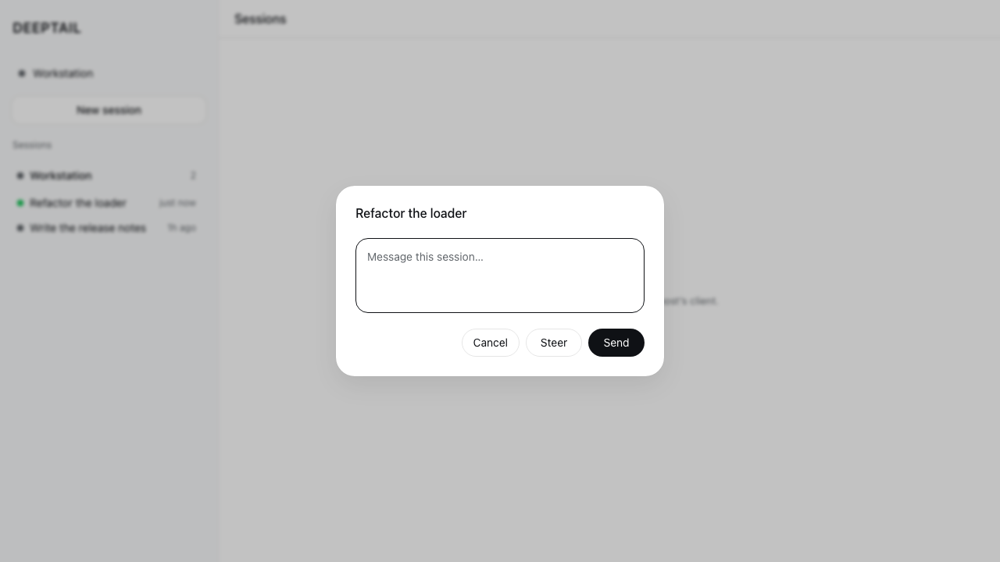
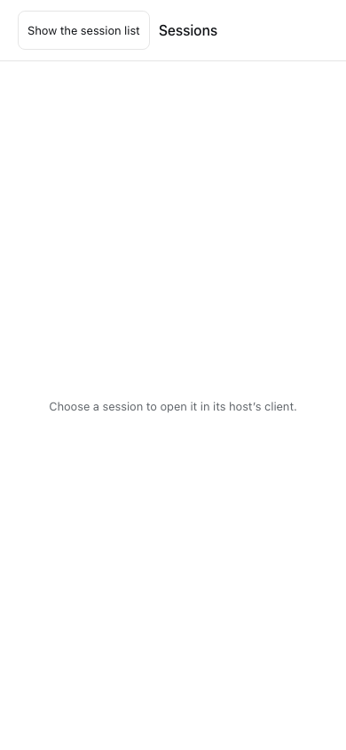

# DeepTail

A Tauri 2 client — desktop, iOS, and Android — that connects to
[DeepSeek Harness](https://github.com/deepseek-ai/deepseek-harness) hosts and
gives you one control plane over the agent sessions running on all of them.



## What it does

**DeepTail is the control plane; the harness client is the reader.** Everything
DeepTail does is a unary call that works over its own carrier today. Reading a
conversation is a stream, and that belongs to the client already built for it.

| DeepTail | The harness client |
|---|---|
| Pair, switch and unpair hosts | Transcripts and tool cards |
| One roster across every paired host, live | Approvals, projects, plans |
| Spawn a session from an agent preset | Everything session-local |
| Message or steer a session | |
| Stop a running turn | |

Choosing a session hands off: DeepTail boots that host's own client. It opens at
the client's default view — nothing in its boot surface takes a session id — and
the copy says so rather than implying a deep link it cannot deliver.

## How it fits together

```
┌── DeepTail (Tauri) ─────────────────┐        ┌── dsh host ──────────────┐
│  webview: control plane + shell     │        │                          │
│    __DSH_TRANSPORT__ ──┐            │        │  /api          (unary)   │
│                        │ IPC        │ HTTPS  │  /api/remote.mux (streams)│
│  Rust: registry, token,│            ├───────▶│  /plugins/<id>/client.js │
│        reqwest, mux ───┴────────────┤        │                          │
└─────────────────────────────────────┘        └──────────────────────────┘
```

**The webview never opens a network connection.** Tauri serves the page from a
secure-context origin, so it cannot open a `ws://` socket at all and cannot
attach an `Authorization` header to a WebSocket handshake. Holding the wire in
Rust removes both limits, keeps the device token out of JavaScript, and lets the
app ship a CSP that names no host:

```
default-src 'self'; script-src 'self' blob:; connect-src ipc: http://ipc.localhost
```

## Design

The UI is plain DOM — it paints before any harness bundle loads — but not a
separate design language. `src/styles/tokens.css` holds the harness's own
resolved `--dsw-alias-*` and `--dsw-specific-*` values and its
`body[data-ds-dark-theme]` mechanism; geometry follows `ui-sidebar`,
`ui-primitives/Menu`, `ui-primitives/Modal` and `ui-workspace/rows`.

**No inline styles.** Every visual is a class, enforced by
`scripts/check-no-inline-styles.ts`, which scans every module and the shell
document for `.style.`, `style=` and `cssText`. The gate has no allowances:
`color-scheme` is a CSS property keyed off the same `body[data-ds-dark-theme]`
attribute as the palette, so native UA chrome cannot drift from the theme.

| | |
|---|---|
|  |  |
| Host switcher — selection is a trailing check, never a fill | The harness dark palette |
|  |  |
| Message or steer a session | 390×844, sidebar as a drawer |

Every state is built and screenshotted: loading, empty-after-settled, error,
partial failure (one host down, the rest still listed), unauthorized, and
offline. `apps/deeptail/tests/screenshots/` holds all seventeen, and each is
written by the case that asserts the state, so none can drift from the code.

## Layout

```
apps/deeptail/
  src/            shell, connection menu, roster, dialogs, carrier, stream client
  src-tauri/      the entire network and credential surface
packages/host-fleet/   Cordis plugin: sessions_* orchestration tools
profile/               the dsh profile DeepTail installs on a host
```

## Credentials

One device token per host in the platform's own store. The all-in-one `keyring`
crate is desktop-only in its default feature, so this uses `keyring-core` with
one native store per target — which is what makes iOS and Android work:
`apple-native-keyring-store`, `android-native-keyring-store` (Keystore +
SharedPreferences), `windows-native-keyring-store`,
`dbus-secret-service-keyring-store`.

Pairing spends the launch token `dsh web` already prints. Plaintext pairing is
refused off loopback.

## Harness seams

Reading a conversation needs the harness client, and that client cannot boot
until three changes land upstream. The control plane does not depend on them.

| Seam | Why |
|---|---|
| A socket factory on `ClientTransportHooks` | `remoteStreamUrl()` derives the mux authority from `location.origin`, and a secure-context page cannot open `ws://` |
| `collectIndexInjections()` over an authenticated `/api` route | the boot table is reachable only as injected HTML |
| Promote `applyIndexInjections` out of `packages/experimental/` | a non-served shell needs it, and that package is not published |

## Development

```sh
bun install
bun run validate          # lint, styles gate, typecheck, tests, knip, clippy, cargo test, browser
bun run tauri dev         # desktop
bun run tauri android dev # Android Studio, JAVA_HOME, ANDROID_HOME, NDK_HOME
bun run tauri ios dev     # macOS + Xcode + CocoaPods only
```

Browser tests drive the real built bundle in Chromium and substitute only the
Tauri IPC boundary, which no browser provides. They assert on rendered text and
roles and write every screenshot above. The scripted IPC covers the mux socket
as well as unary calls, so the live roster — a row arriving over `$events`, a
removal, a status flip, a dropped stream — is exercised rather than assumed.

Playwright resolves the Chromium it installed. An image that pre-ships one at a
fixed path instead names it in `apps/deeptail/tests/chromium.json`:

```json
{ "executablePath": "/opt/pw-browsers/chromium-1194/chrome-linux/chrome" }
```

## Toolchain

TypeScript 7.0.2 · Bun 1.4 · Node 24 LTS · Tauri 2.11 · Rust edition 2024 ·
Vite 8 · Playwright 1.62.1.

## License

MIT
